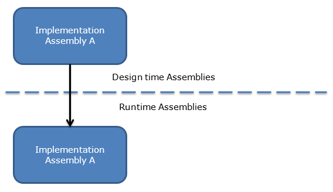
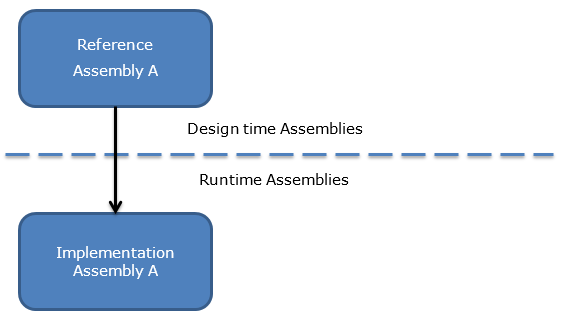
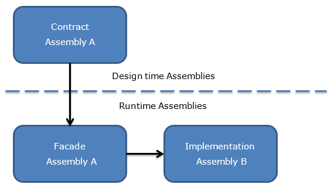
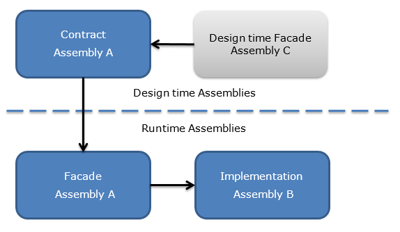
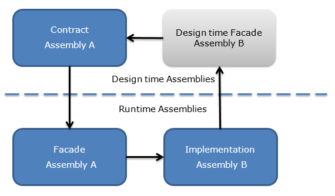
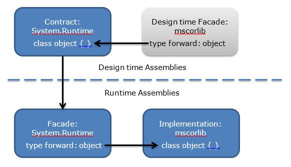
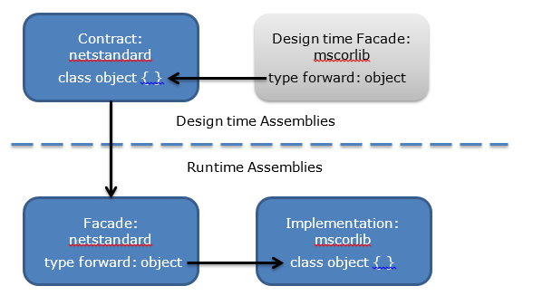

##Introduction
There are various different constraints that come into play when designing programming platforms like our various .NET platforms. Often you have conflicting constraints from the design time and runtime side of the platform. From the design time side you want to present a unified consistent set of APIs to the developer for all the different platforms. However, from the runtime side, you care more about performance and reliability of the implementation that is optimal for the underlying platform which you are running on. These two sides can be at odds with each other in various aspects, like how the assemblies are factored, serviced, or versioned, which means either the overall ecosystem or an individual platform suffers in some respects.

To help alleviate these tensions we have been working towards a model where we can decouple the design time from the runtime, so that we can factor and version each independently without completely impacting the other. Sure, there are still constraints on each other, like a given platform must decide if it wishes to support a specific version of a contract, but that is a black or white decision and with the help of facades the platform doesn’t have many constraints beyond implementing the contract. This document will talk about the evolution of design time assemblies, and how different kind of assemblies work.

## Definitions
- **Type Forward:** A type forward is an entry in an Assembly Exported Type Table which contains a type reference to a type in another assembly. It is used if you want to move a type from one assembly to another and still allow for pre-existing assemblies that reference that type to have it resolved at runtime.
- **Implementation Assembly:** The raw standard IL assembly which contains all the IL code that needs to be executed at runtime.
- **Reference Assembly:** This is a standard IL assembly but it only contains metadata and no IL code. In other words only the declarations and no definitions, you can think of this similar to a C++ header file.
- **Contract Assembly:** This is a reference assembly which has been designed to contain a specific set of APIs only. Before .NET Core the APIs in a reference assembly matched 1-to-1 with the corresponding implementation assembly. Contracts are by design not that way, instead we pick and choose the APIs we want to expose and then make the implementation support them. Moreover, in the past reference assemblies had an assembly identity matching that of the corresponding implementation assembly. Contracts break away from that relationship. Simply observing a Contract Assembly does not reveal the relation to the implementation assembly/-ies that may be available at runtime.
- **Facade Assembly:** This is a standard IL assembly which contains only type forwards. Since type forwards are stored in the exported type table this assembly doesn’t contain any IL and minimal metadata (only the assembly level metadata).
- **Partial Facade Assembly:** This is similar to a Facade Assembly but it contains a mixture of type forwards as well as some type definitions.
- **Design time Facade Assembly:** This is a facade assembly that is used at design time by the tools to align types identities across other sets of reference assemblies.

### Definitions for the layer diagrams
- **Design time Assembly:** An assembly that is used by tools on a developer machine. Such tools typically include compilers (C#, VB, as well as XAML) and various msbuild and VS tools. They generally don’t need to contain any implementation because they are primarily an abstraction for what a given platform supports. Could be either an implementation, reference, contract, or design time facade assembly.
- **Runtime Assembly:** This is the raw assembly used by the runtime on an end user’s machine. These are consumed by the runtime (aka CLR/CoreCLR) and need actual code in them to execute. Could be either an implementation, facade, or partial facade assembly

## Evolution of Design time assemblies

### Using implementation assemblies
In the beginning, when building .NET applications, people directly compiled against the implementation assemblies that existed on the developer’s machine, so the design time and runtime assemblies were exactly the same.

  *Figure 1 - Implementation Assemblies*

### Using reference assemblies
One of the big issues with taking direct dependencies on the implementation assemblies is that the developer is tightly coupled to a particular framework version. In a world where we have multiple versions of the .NET framework (v4.0, v4.5, v4.6, etc) developers need to be able to write an application that can work on any particular version. To support this scenario we created a feature called multi-targeting in which we created a set of reference assemblies for each version of the framework. We referred to these sets of reference assemblies as Targeting Packs. Targeting Packs are only deployed to the developers machine and used by tools to ensure developers didn’t use APIs that weren’t supported on the particular version they were targeting.

 *Figure 2 - Reference Assemblies*

With multi-targeting, Reference Assembly A in the figure above has the same assembly name and key as the implementation assembly, but not necessarily the same version number. The implementation can be a newer version than the reference assembly.

###   Using contract assemblies
Beyond a simple version of the .NET framework we now support a number of .NET platforms (i.e. .NET Framework, .NET Core, Phone, SL, Mono, Xamarian, etc). Each platform has a different set of constraints which caused divergences in the contents of assemblies, as well as the shape or even behavior of certain APIs. This was mostly due to implementation constraints. In order to allow for a consistent .NET ecosystem across the different platforms, we have introduced Contract Assemblies which are designed independently from the underlying implementation and are consistent across all the various platforms. This enables us to completely decouple the design time from the runtime which allows us to support building libraries against a set of contracts that can be run on many of our different platforms. An important thing to note is that the Contract Assemblies design offers the underpinning for portable libraries moving forward.

 *Figure 3 - Contract Assemblies*

As long as the contract assembly identity matches that of some assembly in the implementation, the runtime can still support those assembly references. In a number of cases we have Facade assemblies which match the identities of the contracts but simply type forward all the types to their respective implementation assembly. Theses facades provide us an abstraction layer that allows individual platform implementations to be factored differently all the while the developer view at design time remains the same. Not shown in the figure above, we have full freedom of supporting a Contract Assembly on more than one Implementation Assembly; conversely an Implementation Assembly may offer the implementation for more than one Contract Assembly. In general, the relationship between contracts and implementations should be assumed to be N-to-M.

One other interesting issue that we run into with contract assemblies is consuming pre-existing libraries that were built against another version or platform which has older assembly references. To support such scenarios we have the notion of Design Time Facades which are reference assemblies that match other target framework assembly identities, and type forward all the types to where they currently live in the various contract assemblies. Thus, a targeting pack may contain the expected Contract Assemblies, as well as a suite of Design Time Facades, which are there to support compile-time compatibility with other (including older) targets.

 *Figure 4 - Design Time Facade*

A particular role Design Time Facades play is helping runtime designers - like our UWP UI designer - reliably obtain the metadata of types. Since the relation contract-to-implementation is N-M, and designers can only know the runtime assembly of a type, we needed a mechanism to map a runtime type back into the targeting pack. Design Time Facades fulfill this role. In the targeting pack for Universal Windows Apps, we have Design Time Facades corresponding to implementation assemblies. When the designer encounters a runtime type in an assembly “B”, it will find a corresponding reference assembly “B” in the targeting pack, which happens to type forward the type into the Contract Assembly “A” – see figure below.

 *Figure 5 - Design Time Facade for Implementation Mapping*

To tie together all these with a single example let’s consider how we would define “object” in a contract called System.Runtime but still keep object in mscorlib in the implementation.

 *Figure 6 - Object example*

The example may seem a little silly and perhaps overkill but we must realize the power this abstraction gives us. It allows us to essentially put “object” anywhere we want on either side of the line which gives us the flexibility we need to meet the conflicting constraints we have on the various .NET platform runtimes while keeping a unified view of the APIs for our developers to consume.

### .NET Standard assemblies

With .NET Standard 2.0 we are using a specialized form of contract assemblies which is that we merged all of them into one assembly called netstandard.dll. Which means that netstandard.dll is the only thing that contains any type definitions but we do have a number of design time facades to make it compatible with both the mscorlib and the System.Runtime reference assembly sets.

 *Figure 7 - Object example with netstandard*

##Use the right assemblies for the job
Now that we have looked at different types of assemblies and how they work we should spend a little time talking about when to use which type of assembly. In general, when building your projects, you should stick to the assemblies in the design time assembly set for the platform or platforms that you want your library or application to run on. Doing that will give you a much greater chance of your code to continue to work in the future as that is the public API contract that the platform providers are giving you and claim they will support in future versions. If you take a dependency directly on the implementation assemblies, there is no guarantee that it will work in the future.

For example in .NET Core the core assembly in the implementation is System.Private.CoreLib and it has **Private** in its name for a reason which is that is an implementation detail that may change in the future, instead folks should use System.Runtime which is the design time reference assembly identity that we guarantee will remain compatible. So if you end up taking a dependency on System.Private.CoreLib in your application you are at risk that your library or application may not work in a future version and you are also binding yourself to one concrete platform, which is .NET Core in this case, as opposed to having a library that might run on multiple .NET Platforms if you targeted something like the references in .NET Standard.

Beyond just compiling against the correct set of assemblies you should also be cautious about which assembly identities you persist in serialization blobs or at runtime for reflection purposes. If you depend on the type/assembly identities in the set of design time assemblies, you will more likely be able to reuse the reflection code or serialized data on other .NET Platforms, including future versions of the one you are running on.
